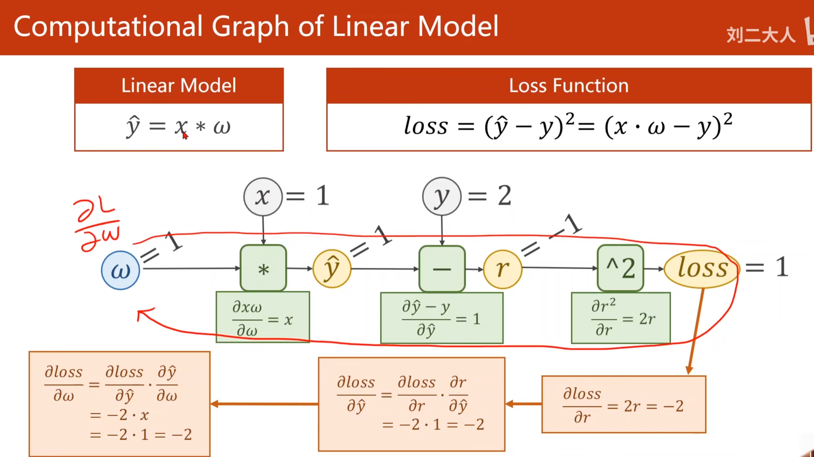

<!-- TOC -->
* [**1.是否代码中的w最开始都是人工给定的？**](#1是否代码中的w最开始都是人工给定的)
    * [🎯 为什么要给一个初始值？](#-为什么要给一个初始值)
    * [📋 在你见过的代码中，初始值是这么来的：](#-在你见过的代码中初始值是这么来的)
    * [🚀 为什么初始值不能都是 0？](#-为什么初始值不能都是-0)
    * [💡 这个初始值有多重要？](#-这个初始值有多重要)
* [**2.反向传播_链式法则需要计算导数，损失L对输入x和权重w求导有什么意义？**](#2反向传播_链式法则需要计算导数损失l对输入x和权重w求导有什么意义)
    * [🧠 一句话回答](#-一句话回答)
    * [1. 对权重 w 求导（∂L∂w∂*w*∂*L*）—— **这是核心目的**](#1-对权重-w-求导lwwl-这是核心目的)
    * [2. 对输入 x 求导（∂L/∂x）—— **这是顺带的作用**](#2-对输入-x-求导lx-这是顺带的作用)
      * [🎨 作用一：生成对抗样本（攻击）](#-作用一生成对抗样本攻击)
      * [🔬 作用二：可视化（理解神经网络在看什么）](#-作用二可视化理解神经网络在看什么)
    * [3. 为什么需要“链式法则”？](#3-为什么需要链式法则)
    * [📊 用你之前跑过的线性回归代码来对比](#-用你之前跑过的线性回归代码来对比)
    * [💡 总结](#-总结)
* [**3.所有中间计算方块的公式都是已知的吗，都是固定的吗**](#3所有中间计算方块的公式都是已知的吗都是固定的吗)
    * [1. 每个方块内部的公式是“已知且确定的”](#1-每个方块内部的公式是已知且确定的)
    * [2. 但“方块的结构”是由你决定的（所以整体不是固定的）](#2-但方块的结构是由你决定的所以整体不是固定的)
    * [3. 在 PyTorch 中，这些公式已经写好了](#3-在-pytorch-中这些公式已经写好了)
    * [📊 总结](#-总结-1)
    <!-- TOC -->
# **1.是否代码中的w最开始都是人工给定的？**

在深度学习中，**权重 `w` 在最开始确实都是人工给定的一个初始值**。

这个初始值是我们“猜”的一个起点，然后通过训练不断优化它，让它越来越接近我们想要的那个“最优值”。

### 🎯 为什么要给一个初始值？

你可以把训练模型想象成**在一个完全黑暗的房间里，要找到一个最低点**。

- 如果“站着不动” (w=0)，你永远找不到方向。
- 如果“随便迈一步” (w=1.0)，你就有了一个**起点**，才能根据梯度下降的方向，一步一步往下走。

**所以，初始值是“启动”训练过程的第一步。**

------

### 📋 在你见过的代码中，初始值是这么来的：

1. **你手动写死的（最常见）**
   在你的代码里，直接写了 `w = 1.0`。

   python

   ```
   w = 1.0  # 这就是人工给定的初始值
   ```

   或者有时候为了测试，我们会故意给一个“离谱”的值（比如 `w = 5.0`），看看模型能不能自己纠正回来。

2. **PyTorch 帮你随机生成的**
   在你跑过的 `class SimpleNN` 那一节课里，你并没有看到 `w = 1.0`，因为 **PyTorch 已经帮你做了这件事**。
   当你写下 `self.fc1 = nn.Linear(10, 20)` 时，PyTorch 会自动在那个层里初始化几千个 `w` 和 `b`（偏置），**初始值是从一个特定的随机分布里抽出来的**（比如均匀分布或正态分布）。

### 🚀 为什么初始值不能都是 0？

这是一个非常重要的问题。如果所有的初始值都是 0，那么**网络中的所有神经元都会做完全一样的计算**，导致它们学到的特征也完全一样。这就相当于你请了 100 个专家来干活，但这 100 个人都只会一种技能，那跟请 1 个人没什么区别。所以，我们通常会让初始值有一些“微小的随机性”，来打破这种对称。

### 💡 这个初始值有多重要？

一个好的初始值能让模型训练又快又稳；一个差的初始值会让模型在训练时“原地打转”（梯度消失）或“跑飞了”（梯度爆炸）。

对于你接下来的学习，你只需要记住：

> **每次训练开始时，w 都必须有一个初始值。**
> 在你自己手写代码的时候，它可以是你随便给的 `1.0`；在你用 PyTorch 的时候，它是由框架自动生成的随机值。


# **2.反向传播_链式法则需要计算导数，损失L对输入x和权重w求导有什么意义？**

主要是做权重w更新。




这个问题问得非常深入，也正好是理解深度学习**为什么能学习**的关键所在。

### 🧠 一句话回答

**损失对 x 求导，是为了“追溯数据的影响”；损失对 w 求导，是为了“指导模型改进”。**

简单来说：**对 w 求导是为了“学习”（更新参数），对 x 求导是为了“解释”（做对抗样本或风格迁移）。**

------

### 1. 对权重 w 求导（∂L∂w∂*w*∂*L*）—— **这是核心目的**

这是我们**最主要**的目的。它回答的问题是：**“如果我把 w 调大一点，损失 L 会变大还是变小？”**

- **意义**：根据导数的正负和大小，我们直接获得一个**具体的数值**，用来更新 w。
- **公式**： w_new = w - 学习率 × ∂L/∂w
- **结果**：只要一直沿着这个梯度的反方向走，L 就会不断下降，模型就学会了。

> **你最常听到的“反向传播”，99% 的时间都是在计算这个 ∂L/∂w。**

------

### 2. 对输入 x 求导（∂L/∂x）—— **这是顺带的作用**

这不是我们训练的目的，但它确实有非常重要的意义。它回答的问题是：**“如果我把输入图片稍微改一点点，损失 L 会怎么变？”**

#### 🎨 作用一：生成对抗样本（攻击）

如果你给一张猫的图片加上一点精心计算的、人眼看不出的噪声，使得 ∂L/∂x 的方向正好让模型把它分类成“狗”，这就生成了一个**对抗样本**。这就是“对 x 求导”最著名的应用。

#### 🔬 作用二：可视化（理解神经网络在看什么）

通过求 ∂L/∂x，我们可以把神经网络的“注意力”还原成图片。比如，我们可以计算出“哪些像素对模型认出‘猫’最重要”，然后把最重要的像素用高亮显示出来。这种技术叫 **“显著图” (Saliency Map)** 或 **“特征可视化”**。

------

### 3. 为什么需要“链式法则”？

你截图里的这个公式非常关键：

∂L/∂w = ∂L/∂z · ∂z/∂w

**如果没有链式法则，这个公式根本无法成立。**

深度神经网络是“多层”的，数据从输入层一步步传递到输出层，中间有很多个环节。要计算 `∂L/∂w`，我们没法直接算（因为 L 和 w 中间隔了很多层），只能**像“剥洋葱”一样，从最外层（Loss）开始，一层层往回传递**。

- `∂L/∂z` 是“损失对中间输出的梯度”（从上层传下来的信号）。
- `∂z/∂w` 是“中间输出对权重的梯度”（当前层自己就能算的）。
- **链式法则**把这两者相乘，就把“上层的信号”传递到了“当前的权重”上。

------

### 📊 用你之前跑过的线性回归代码来对比

在你看过的 `GD.py` 代码里：

1. **对 `w` 求导**（代码中的 `gradient` 函数）：
   - 作用：算出 `grad`，然后用于 `w -= 0.01 * grad`，更新了模型参数。
   - 这就是**你训练模型的核心过程**。
2. **对 `x` 求导**：
   - 作用：如果算出来，你可以看到“改变 x 对损失的影响”，但你在训练时不会去改 x（数据是固定的）。
   - 这就是**你没有用到，但在图像生成、对抗攻击中非常重要的工具**。
   - x也可能是上一层神经网络的输入。

------

### 💡 总结

| 求导对象        | 使用场景                       | 作用                                                     |
| :-------------- | :----------------------------- | :------------------------------------------------------- |
| **对 `w` 求导** | **训练阶段（你每天都在做的）** | **指导模型参数更新，让 Loss 下降，这是深度学习的“引擎”** |
| **对 `x` 求导** | 推理/分析阶段（解释模型）      | 判断输入数据如何影响输出，用于可视化、对抗攻击、风格迁移 |

所以，当听到别人说“反向传播”时，其实主要是**对 w 求导**。而链式法则，就是让这个“求导”能在几十上百层网络里顺利传递的计算工具。😊


# **3.所有中间计算方块的公式都是已知的吗，都是固定的吗**

**结论：是的，对于你定义的网络，所有中间计算方块的公式都是已知的。但是，它们不是“固定的”，而是由你定义的网络结构决定的。**

我们可以把这个问题分成两个层面来理解：

------

### 1. 每个方块内部的公式是“已知且确定的”

当一个方块代表一个具体的操作时，它的公式就是确定的。

| 操作类型             | 前向公式           | 反向求导公式                          |
| :------------------- | :----------------- | :------------------------------------ |
| **加法**             | `z = x + y`        | `∂z/∂x = 1`, `∂z/∂y = 1`              |
| **乘法**             | `z = x * y`        | `∂z/∂x = y`, `∂z/∂y = x`              |
| **ReLU 激活**        | `z = max(0, x)`    | `x > 0` 时导数为 1，否则为 0          |
| **线性层（全连接）** | `z = x * w + b`    | `∂z/∂w = x`, `∂z/∂x = w`, `∂z/∂b = 1` |
| **Sigmoid**          | `z = 1/(1+e^(-x))` | `∂z/∂x = z * (1 - z)`                 |
| **损失函数（MSE）**  | `L = (z - y)²`     | `∂L/∂z = 2 * (z - y)`                 |

**这些公式都是已知的微积分结果**，从定义操作的那一刻起就是确定的。

------

### 2. 但“方块的结构”是由你决定的（所以整体不是固定的）

虽然每个操作本身的公式是固定的，但你把**哪些方块串在一起**，是由你定义的网络结构决定的。

你可以把神经网络想象成**搭积木**：

- 每个积木的形状（公式）是固定的（比如 ReLU 这个积木，它的公式永远不变）。
- 但是**积木的组合方式**是你自己选的。你选择“线性层 → ReLU → 线性层 → Sigmoid”，和你选择“线性层 → Sigmoid → 线性层 → ReLU”，得到的是完全不同的网络。

**举个例子：**

| 网络结构      | 中间计算方块序列                               | 整体公式                                             |
| :------------ | :--------------------------------------------- | :--------------------------------------------------- |
| 2层全连接网络 | `L1 → ReLU → L2`                               | `输出 = W2 * ReLU(W1 * x + b1) + b2`                 |
| 3层全连接网络 | `L1 → ReLU → L2 → ReLU → L3`                   | `输出 = W3 * ReLU(W2 * ReLU(W1 * x + b1) + b2) + b3` |
| 卷积神经网络  | `Conv → ReLU → Pool → Conv → ReLU → Pool → FC` | 更复杂的复合函数                                     |

**所以，整体公式不是固定的，它依赖于你搭建的网络结构。但组成这个整体的每一个“小积木”（操作）的公式是固定的。**

------

### 3. 在 PyTorch 中，这些公式已经写好了

| 操作    | 前向公式             | 反向公式                    | 在 PyTorch 中的位置 |
| :------ | :------------------- | :-------------------------- | :------------------ |
| 线性层  | `y = xW^T + b`       | `∂L/∂W = x^T * ∂L/∂y`       | `torch.nn.Linear`   |
| ReLU    | `y = max(0, x)`      | `x > 0` 时梯度为 1          | `torch.nn.ReLU`     |
| Conv2d  | `y = x * W + b`      | 自动推导                    | `torch.nn.Conv2d`   |
| MSELoss | `L = (y_pred - y)^2` | `∂L/∂y_pred = 2*(y_pred-y)` | `torch.nn.MSELoss`  |

当你调用 `loss.backward()` 时，PyTorch 会：

1. 沿着计算图从后往前遍历。
2. 找到每个方块对应的**已知导数公式**。
3. 用链式法则把它们乘起来。

------

### 📊 总结

| 问题                               | 答案                                         |
| :--------------------------------- | :------------------------------------------- |
| **每个操作内部的公式是已知的吗？** | ✅ 是的，数学上已知                           |
| **每个操作内部的公式是固定的吗？** | ✅ 是的，比如 ReLU 的公式永远是 `max(0, x)`   |
| **整个网络的所有公式是固定的吗？** | ❌ 不是，**整体公式取决于你搭建的网络结构**   |
| **我需要手动算这些公式吗？**       | ❌ 不用，PyTorch 已经内置了所有常见操作的公式 |

**所以，你只需要学会“搭积木”（定义网络结构），剩下的数学公式，PyTorch 已经帮你准备好了。** 😊


# 4.训练集shuffle=True，而测试集shuffle=False，那么在后续计算值与真实值对比的时候是如何找到对应关系的，怎么计算损失的


这个问题的核心在于：**DataLoader 中的 `shuffle=True` 只影响数据被“喂”给模型的顺序，但不会切断样本和标签之间的“一一对应关系”。**

只要你的数据在打包成 `(input, target)` 元组时没出错，无论打乱多少次，每个 `input` 都随身携带着它正确的 `target`。

------

### 🔍 1. 对应关系是如何保持的？

在 `Dataset` 的 `__getitem__` 方法中，数据是这样返回的：

python

```
def __getitem__(self, index):
    # 这里的 index 可能是一个经过打乱的随机索引
    img = self.x_data[index]  # 根据索引取出图片
    label = self.y_data[index] # 根据**同一个**索引取出标签
    return img, label          # 图片和标签被牢牢地打包在一起
```


**关键点在于**：无论是顺序取还是随机取，`img` 和 `label` 都来自 **同一个 `index`**。这个“打包”过程保证了它们之间的对应关系绝不会出错。

当你设置 `shuffle=True` 时，DataLoader 打乱的是“索引的顺序”（如 `[0,1,2]` 变成 `[1,0,2]`），而不是将“索引”和“数据”本身打乱。

------

### 🧮 2. 损失计算的过程

当模型计算损失时，也是由这种“打包”机制贯穿全流程的：

1. **取数据**：DataLoader 生成一个打乱后的索引列表。
2. **打包**：`Dataset` 根据索引，打包成 `(input, label)` 元组。
3. **预测**：模型把 `inputs` 送进去，得到预测结果 `predictions`。
4. **计算损失**：**损失函数会把 `predictions` 和 `labels` 按位置一一对应起来。**（`predictions[0]` 对应 `labels[0]`，`predictions[1]` 对应 `labels[1]`，以此类推）

因为 `labels` 是随着 `inputs` 一起被打包进 DataLoader 的，所以它们的顺序和位置始终一致，计算损失时绝不会发生错位。

------

### 💡 3. 为什么测试集需要关闭 Shuffle？

这是一个非常巧妙的设计：

- **训练集打乱 (`shuffle=True`)**：目的是为了让模型看到不同顺序的数据，防止它“记住”固定顺序，从而提高泛化能力。
- **测试集不打乱 (`shuffle=False`)**：目的是为了**保持结果的可复现性和可解释性**。它确保我们评估模型时，数据和标签的顺序是固定的。这样，如果你发现模型在某些样本上表现不佳，可以轻松地回溯到原始数据集中，找到对应的样本进行分析，而不用费力去匹配随机顺序。

所以，你完全不用担心对应关系会错乱。这种“随机取数据，但绝不拆散输入和标签”的设计，是 PyTorch DataLoader 最基础、也最可靠的功能之一。😊